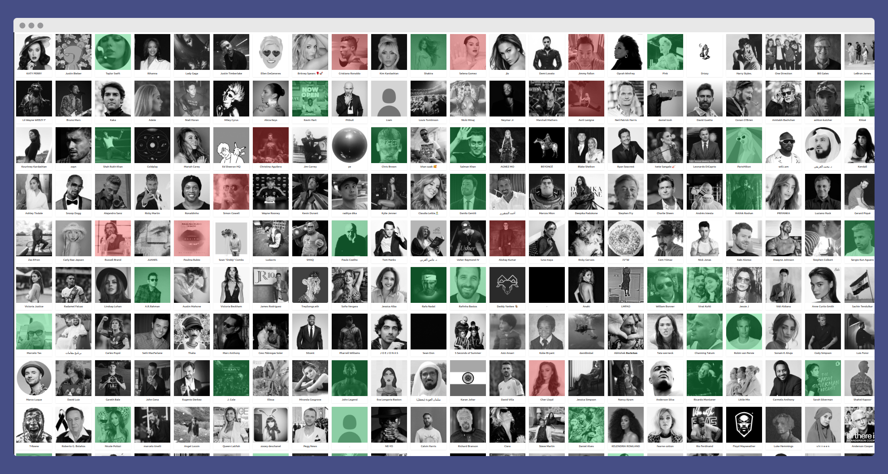

# CelebrityWall

**Description**: The goal of this project is to provide a big picture of celebrities and their stance regarding what is happening in Iran.

- **Technology stack**: At the moment, this is a front-end only website written in Typescript using React framework.
- **Status**: Under development. Refer to [CHANGELOG](CHANGELOG.md).
- **Live version**: [wall.wearemahsaamini.com](https://wall.wearemahsaamini.com)

**Screenshot**:

## Dependencies

- NodeJS
- Yarn

## Installation

- Assuming you've already have nodejs and yarn installed, go ahead and clone the project.
- Then you need to run `yarn install` to install the dependencies.
- At this you should be able run the project via `yarn start`.

## Known issues

- Performance on mobile

## Getting help

If you have questions, concerns, bug reports, etc, please file an issue in this repository's Issue Tracker.

## Getting involved

_TBD_

Fork the project, apply your changes, and submit a PR. The templates will be provided soon.
